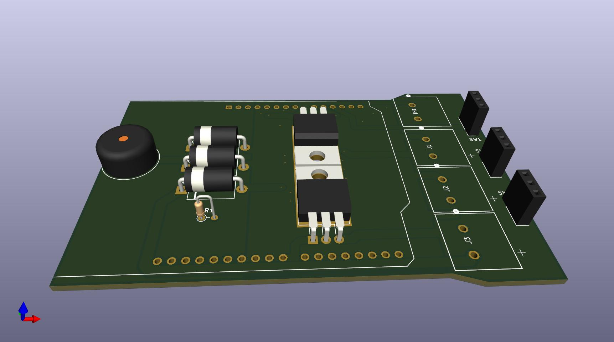

# Electronics component list

Bill of materials for the Arduino control side of the liquid cooling suit. Values match the [control shield schematic](arduino-shield/arduino-shield.pdf). KiCad source files in `arduino-shield/` are maintained separately and are not edited from this repo workflow.

**Assembly goal:** stack shields on an **Arduino Uno R3** with **minimum soldering** — plug-in headers and screw terminals for field wiring; only populate/solder the control shield PCB if you order it bare. If you are new to soldering, see [Soldering and wire splicing](#soldering-and-wire-splicing) below.

## Table of contents

- [Stack (bottom to top)](#stack-bottom-to-top)
- [Core components](#core-components)
- [Control shield](#control-shield-included-in-stack)
  - [DigiKey quick order (bare shield populate)](#digikey-quick-order-bare-shield-populate)
- [Assembly instructions](#assembly-instructions)
  - [Board placement guide](#board-placement-guide)
  - [Before you start](#before-you-start)
  - [Step 1 — Populate the bare control shield](#step-1--populate-the-bare-control-shield)
  - [Step 2 — Build the Arduino stack](#step-2--build-the-arduino-stack)
  - [Step 3 — Panel switches and NTC](#step-3--panel-switches-and-ntc)
  - [Step 4 — 12 V power and pump](#step-4--12-v-power-and-pump)
  - [Step 5 — Load firmware](#step-5--load-firmware)
  - [Step 6 — Bench test](#step-6--bench-test)
- [Ordering the PCB from Gerber files](#ordering-the-pcb-from-gerber-files)
- [Wire and cable](#wire-and-cable-minimum-soldering)
- [Soldering and wire splicing](#soldering-and-wire-splicing)
  - [How to solder (NASA reference)](#how-to-solder)
  - [How to splice wire properly](#how-to-splice-wire-properly)
  - [Heat-shrink on splices](#heat-shrink-on-splices)
- [Quick wiring reference](#quick-wiring-reference)
- [Suggested order checklist](#suggested-order-checklist)
- [12 V safety and enclosure](#12-v-safety-and-enclosure)

---

## Stack (bottom to top)

| Layer | Part | Notes |
| --- | --- | --- |
| 1 | **Arduino Uno R3** | ATmega328P, 5 V logic. Powers from 12 V barrel jack or VIN when on battery. |
| 2 | **Heatsink control shield** | [arduino-shield.pdf](arduino-shield/arduino-shield.pdf) + [placement diagram](arduino-shield/arduino-shield.jpg) — stacking headers, Q1/Q2, R1, D1–D3, TH1 header, SW1–SW3 headers, buzzer, 12 V pump/spare terminals. Solder only if you receive a bare PCB. |
| 3 | **LCD shield (no buttons)** | 20×4 HD44780, **display only** — no keypad, no built-in push-buttons. Plugs onto the stack; uses D5, D6, D10–D13 (see [pin summary](readme.md#pin-summary)). Do **not** use an LCD Keypad Shield — firmware uses external panel switches on D2–D4. |

External to the stack (crimp or screw terminals, no board soldering): **three panel switches**, **Bosch M12 NTC** cable to TH1 header, **12 V** pump and power leads.

---

## Core components

| Qty | Ref | Description | Part number / spec | Notes |
| --- | --- | --- | --- | --- |
| 1 | U1 | Microcontroller | **Arduino Uno R3** | Required for direct shield stacking. |
| 1 | — | LCD shield | **20×4 HD44780 LCD shield, no buttons** | e.g. parallel “LCD2004” shield without keypad. Display-only — temp/PWM/alarm text; switches stay on the panel. |
| 1 | TH1 | NTC temperature sensor | **Bosch M12** NTC | [Datasheet (70101387)](https://www.bosch-motorsport.com/content/downloads/Raceparts/Resources/pdf/Data%20sheet_70101387_Temperature_Sensor_NTC_M12.pdf). Mount in **collection manifold** at the suit (return path), not in the ice box. Requires **M12 tap** and sealant on metal manifold. |
| 1 | R1 | Fixed resistor, top of NTC divider | **MFP50SBBE52-50K** (50 kΩ, 0.1%, 1/2 W) — DigiKey **MFP50SBBE52-50K-ND** | Solder on control shield between AREF rail and A0; TH1 from A0 to GND. |
| 3 | D1, D2, D3 | Flyback diode (inductive loads) | **1N5407RL** (DO-27, 3 A) — DigiKey **1N5407RL-ND** (or **1N5407RLG-ND** if RL is unavailable) | One each across Q1, Q2, and the spare 12 V path — cathode to +12 V, anode toward transistor collector (per [schematic](arduino-shield/arduino-shield.pdf)). |
| 2 | Q1, Q2 | NPN Darlington, low-side switch | **TIP120** (TO-220) | Q1: pump on **D9** (PWM, up to **5 A**). Q2: spare 12 V on **D8**. Mount to shield **copper thermal zones** with **nylon M3** bolt + nut each — **no metal fasteners** (12 V on tab). No add-on heatsinks. |
| 2 | — | Transistor mounting | **M3 nylon** bolt + nut (×2 sets) | One per **Q1** and **Q2** tab hole. **Do not use metal** screw/nut/washer — can short **12 V** to ground. |
| 2 | SW1, SW2 | Panel switch, momentary | **100SP4T1B2M2QE** | Temp up (D2) and temp down (D3). **Switch guard** recommended (see below). |
| 1 | SW3 | Panel switch, maintained toggle | **ANT13SECQE** | Pump manual/auto on **D4**. **Switch guard** strongly recommended — prevents accidental pump override. |
| 3 | — | Switch guard | Compatible with **100SP** / **ANT** panel switches | Optional but recommended: covers/guards that block accidental bumps (especially on SW3). Match guard to switch series and actuator type per supplier catalog. |

---

## Control shield (included in stack)

| Qty | Ref | Description | Part number / spec | Notes |
| --- | --- | --- | --- | --- |
| 1 | — | **Heatsink control shield** PCB | Gerbers in [`arduino-shield/gerbers/`](arduino-shield/gerbers/) | Bare board — populate per schematic PDF. |
| 1 | — | Shield stacking headers | **Adafruit #85** / DigiKey **1528-1074-ND** | One kit per bare shield: 2×6 + 2×8 + 1×10 long-tail stacking female for Uno R3 stack (control shield between Uno and LCD). |
| 1 | R1 | NTC divider resistor | **MFP50SBBE52-50K-ND** | Also listed under [Core components](#core-components). |
| 3 | D1–D3 | Flyback diodes | **1N5407RL-ND** (or **1N5407RLG-ND**) | Also listed under [Core components](#core-components). |
| 2 | Q1, Q2 | Darlington switches | **TIP120** + **M3 nylon** bolt/nut each | Also listed under [Core components](#core-components). **No metal** tab hardware. |
| 1 | BZ1 | Buzzer | TDK **PS1240P02BT** class, 12 mm, polarized | Alarm on **D7** (>30 °C for 2 min). |

Order assembled if you want zero soldering; on a bare PCB, solder stacking headers, TIP120 (to copper thermal zones with **nylon M3** hardware), R1, D1–D3, buzzer, and field connectors per the schematic PDF.

### DigiKey quick order (bare shield populate)

| Qty | DigiKey | Manufacturer P/N | Ref / use |
| --- | --- | --- | --- |
| 1 | [1528-1074-ND](https://www.digikey.com/en/products/result?keywords=1528-1074-ND) | Adafruit **#85** | Shield stacking headers (2×6 + 2×8 + 1×10) |
| 1 | [MFP50SBBE52-50K-ND](https://www.digikey.com/en/products/result?keywords=MFP50SBBE52-50K-ND) | MFP50SBBE52-50K | R1 — NTC divider |
| 3 | [1N5407RL-ND](https://www.digikey.com/en/products/result?keywords=1N5407RL-ND) | 1N5407RL | D1, D2, D3 — flyback (schematic value) |
| 3 | [1N5407RLG-ND](https://www.digikey.com/en/products/result?keywords=1N5407RLG-ND) | 1N5407RLG | Same as above if **1N5407RL-ND** is out of stock (lead-free replacement) |

Search DigiKey for **TIP120** and a **PS1240P02BT**-class buzzer separately; those parts are not Adafruit-line items.

See [Ordering the PCB from Gerber files](#ordering-the-pcb-from-gerber-files) to have bare boards fabricated.

---

## Assembly instructions

End-to-end build for the **Arduino control unit** (Uno + heatsink control shield + LCD shield + field wiring). Coolant plumbing, ice box, and suit hoses are covered in the [readme](readme.md) ([Coolant plumbing](readme.md#coolant-plumbing), [Container setup](readme.md#container-setup)).

### Board placement guide

Use the silkscreen labels and polarity marks on the bare PCB. This shield has **no USB** — only the **Arduino Uno** below it does. The render below is the **control shield alone** (component side up). Match its orientation: **D1** at the top of the diode column, **SW1–SW3** on the **right**, **stacking-header** holes along the long **top and bottom** edges:



| Label | Location on board | What to install / connect |
| --- | --- | --- |
| **D1, D2, D3** | Left column (**D1** top, **D3** bottom) | **1N5407RL** — cathode **band toward D1** (same end as silkscreen **K** / +12 V side). |
| **R1** | Below the diode column | **MFP50SBBE52-50K**, vertical axial. |
| **BZ1** | Left side, round footprint | Polarized buzzer — **+** pin to marked **+** on silkscreen. |
| **Q1, Q2** | Centre, on copper thermal areas | **TIP120** — package **flat on the board**, metal tab on copper, leads bent **90°** toward the **bottom** long edge (same side as in the image). **Q1** above **Q2**. Secure each tab with an **M3 nylon bolt and nut** through the tab hole — **never metal** (12 V present). |
| **SW1, SW2, SW3** | Right edge, **three 3-pin blocks** in a row (top → bottom) | **1×3** sockets for panel switch cables — see [Step 3](#step-3--panel-switches-and-ntc). |
| **TH1** | Four 2-pin blocks, left of SW column (top block) | NTC cable — **+** silkscreen marks sense/reference; other pin is GND. |
| **J1, J2, J3** | Next blocks below **TH1** | Screw terminals — land **+12 V** on pins marked **+**; other pin is switched load or return per [Step 4](#step-4--12-v-power-and-pump). |
| *(headers)* | Top and bottom long rows | **1528-1074-ND** stacking headers for Uno / LCD stack. |

Every part has its own ref label (**SW1**, **Q1**, etc.) printed on the board — match those labels when placing parts.

### Before you start

**Tools:** 20 W soldering iron, rosin-core solder, damp sponge, flush cutters, small screwdriver for screw terminals, crimp tool (optional), multimeter, **2× M3 nylon bolt + nut** for **Q1** and **Q2** (no metal hardware at transistor tabs).

**Parts:** Complete the [suggested order checklist](#suggested-order-checklist) and [DigiKey quick order](#digikey-quick-order-bare-shield-populate) if you are populating a bare shield.

**Reference:** [arduino-shield.jpg](arduino-shield/arduino-shield.jpg) for placement and polarity; [arduino-shield.pdf](arduino-shield/arduino-shield.pdf) for electrical nets.

**Safety:** Work **de-energized** — no battery connected until [Step 6](#step-6--bench-test). See [12 V safety and enclosure](#12-v-safety-and-enclosure) and [Soldering and wire splicing](#soldering-and-wire-splicing).

**Skip PCB soldering** if someone else populated the control shield for you — start at [Step 2](#step-2--build-the-arduino-stack).

### Step 1 — Populate the bare control shield

Only when you received a **bare PCB** from the [Gerber order](#ordering-the-pcb-from-gerber-files). Follow the [board placement guide](#board-placement-guide) and silkscreen labels. Suggested solder order (shortest parts first, then connectors, then tall headers):

| Order | Ref | Part | Notes |
| --- | --- | --- | --- |
| 1 | R1 | **MFP50SBBE52-50K** | Vertical axial in the **R1** footprint below **D3**; trim leads flush on the bottom. |
| 2 | D1, D2, D3 | **1N5407RL** | In the left column (**D1** top, **D2** middle, **D3** bottom). **Cathode band toward D1** (toward **K** / +12 V), as in [arduino-shield.jpg](arduino-shield/arduino-shield.jpg). |
| 3 | BZ1 | **PS1240P02BT**-class buzzer | Round **BZ1** footprint on the left; align **+** on the part with the **+** mark on the board. |
| 4 | SW1, SW2, SW3 | **1×3 pin sockets** (2.54 mm) | Three blocks on the **right** — **SW1** top, **SW2** middle, **SW3** bottom. |
| 5 | TH1, J1, J2, J3 | **2-pin** terminals (Molex **393800102** class) | Four outlined pairs left of the switch column — **TH1** at top, then **J1**, **J2**, **J3**. Note each **+** mark for field wiring. |
| 6 | Q1, Q2 | **TIP120** + **M3 nylon** bolt/nut | Mount **flat** on the copper zones labelled **Q1** (upper) and **Q2** (lower): tab against copper, leads bent down toward the **bottom** edge, then solder. Clamp each tab through the hole with an **M3 nylon bolt and nut only** — **metal screws or nuts will short 12 V** to the board or frame. **No add-on heatsinks.** |
| 7 | — | **Stacking header kit** (1528-1074-ND) | Top and bottom rows — long pins down toward the **Uno**. Kit: **2×6**, **2×8**, **1×10**. Align with a spare Uno before soldering every pin. |

Inspect joints under good light; fix bridges and cold joints. Compare the finished board to [arduino-shield.jpg](arduino-shield/arduino-shield.jpg) and the schematic PDF.

### Step 2 — Build the Arduino stack

Stack order (**bottom → top**):

1. **Arduino Uno R3** on the bench (its **USB** port is on the Uno only — use any stable orientation).
2. **Heatsink control shield** — match [arduino-shield.jpg](arduino-shield/arduino-shield.jpg) when populating; then press stacking headers fully onto the Uno; all pins should seat without force on bent leads.
3. **LCD shield (20×4, no buttons)** — press onto the control shield. Do **not** use an LCD Keypad Shield (firmware expects external switches on **D2–D4**).

Mount the stack in a **dry project box** on the harness or pack — never inside the ice cooler ([readme — dry locations](readme.md#12v-dc-safety-and-dry-locations)).

### Step 3 — Panel switches and NTC

**Panel switches (SW1–SW3):** The three **3-pin blocks** on the right of the board (see [placement diagram](arduino-shield/arduino-shield.jpg)) are **SW1** (top), **SW2** (middle), and **SW3** (bottom). For each block, crimp a **3-position socket** and three leads (0.5 mm²):

| Header | Switch | Wiring |
| --- | --- | --- |
| **SW1** | **100SP4T1B2M2QE** (temp up) | **Middle pin** → switch → **either outer pin** (both outers are **GND**). Active = grounded (**D2**). |
| **SW2** | **100SP4T1B2M2QE** (temp down) | Same — middle pin is **D3**. |
| **SW3** | **ANT13SECQE** (pump manual/auto) | Same — middle pin is **D4**. **ON** = grounded = manual pump override. |

The silkscreen **+** on each switch block marks the pin row orientation — use the **centre pin** for the Arduino signal, not the **+** mark, when wiring a simple two-terminal panel switch. Install **switch guards** on the panel, especially on SW3.

**NTC (TH1):** Top **2-pin** block in the terminal column (**TH1**). Connect the NTC cable to the pins marked on the board (**+** = sense / **A0** divider node, other = **GND**). Mount the **Bosch M12** sensor in the **collection manifold** ([readme — NTC placement](readme.md#coolant-plumbing)). Keep the connector and cable **dry** — only the sensor tip sees coolant.

### Step 4 — 12 V power and pump

Wire with **battery disconnected** and **fuses removed**.

1. **Common ground bus** — tie Arduino GND, battery (−), pump return, and Q1/Q2 emitter returns to one point (star ground in the box).
2. **Fused 12 V distribution** — **5 A max** inline fuse on the battery lead and on each branch: Arduino (barrel jack or VIN), pump **+** rail to **Q1**, spare **+** to **Q2** ([12 V power setup](readme.md#12v-power-setup)).
3. **Pump (Q1, D9)** — On **J1** (and related pump terminals), land **+12 V** on the pin marked **+**; switched/return on the other pin. **+12 V** (fused) → pump **+**; pump **−** → **Q1** low-side output; common **GND**. Use **≥1.5 mm²** wire. Do **not** pass pump current through Arduino pins.
4. **Spare output (Q2, D8)** — **J2** / **J3** same pattern: **+** silkscreen = **+12 V** in; other pin to load return through **Q2** if used.
5. **Polarity check** — verify **+12 V** and **GND** with a multimeter before connecting the battery.

See [Quick wiring reference](#quick-wiring-reference) and the [wiring diagram](readme.md#wiring-diagram).

### Step 5 — Load firmware

1. Connect the Uno to a PC via **USB** (stack can stay assembled; 12 V battery still **off**).
2. Open `firmware/pump-control.ino` in the Arduino IDE (or install from the [firmware folder](https://github.com/Supermagnum/heatsink/tree/main/firmware)).
3. Select board **Arduino Uno** and the correct serial port.
4. Upload. The **20×4 LCD** should show target temperature, sensed temperature, and PWM after boot.

### Step 6 — Bench test

With the **coolant loop filled and leak-checked** before long runs ([readme — assembly and testing](readme.md#coolant-plumbing)):

| Check | Action | Expected |
| --- | --- | --- |
| Power | Connect **fused 12 V**; USB optional for serial debug | LCD on; no excessive heating on wiring |
| NTC | Warm the sensor tip slightly (hand or warm water) | Sensed temperature on LCD changes smoothly |
| SW1 / SW2 | Tap temp up/down | Target steps **15–25 °C** in **5 °C** steps |
| SW3 | Toggle pump override **ON** | Pump runs at full PWM; **OFF** returns to auto control |
| Pump auto | SW3 **OFF**; vary NTC temperature | PWM changes with temperature error |
| Alarm | Simulate over-temp (>30 °C for 2 min) or heat sensor | Buzzer on **D7** sounds |
| 12 V load | Run pump at duty for several minutes | Q1 tab warm but stable; fuses do not blow; no melt/smoke |

Monitor the first field runs for leaks, fuse trips, and connector heat. Fix any weeping coolant joints before extended use.

---

## Ordering the PCB from Gerber files

Production-ready Gerbers for the heatsink control shield are in the repo — you do **not** need KiCad to order boards. Use the files in:

**[`arduino-shield/gerbers/`](arduino-shield/gerbers/)**

### What is in the folder

| File | Purpose |
| --- | --- |
| `arduino-shield-F_Cu.gbr` | Top copper |
| `arduino-shield-B_Cu.gbr` | Bottom copper |
| `arduino-shield-F_Mask.gbr` / `B_Mask.gbr` | Solder mask (top / bottom) |
| `arduino-shield-F_Silkscreen.gbr` / `B_Silkscreen.gbr` | Silkscreen legend |
| `arduino-shield-F_Paste.gbr` / `B_Paste.gbr` | Solder paste (for SMT assembly only — ignore if you hand-solder) |
| `arduino-shield-Edge_Cuts.gbr` | Board outline |
| `arduino-shield-PTH.drl` | Plated through-hole drill hits |
| `arduino-shield-NPTH.drl` | Non-plated holes (if any) |
| `arduino-shield-job.gbrjob` | Job metadata (layer stack, thickness) — optional but helps some fabs |

Board spec from the job file: **2-layer FR4**, **1.6 mm** thick, outline roughly **92 × 61 mm** (Arduino Uno R3 shield form factor).

### How to submit to a PCB fab

1. **Download or clone** the repo and open `arduino-shield/gerbers/`.
2. **Select all** `.gbr` and `.drl` files in that folder (include both drill files).
3. **Zip** them into one archive (e.g. `arduino-shield-gerbers.zip`). Keep filenames unchanged — do not nest an extra subfolder unless the fab asks for it.
4. **Upload** the zip to a board house (e.g. JLCPCB, PCBWay, OSH Park, Aisler, or any fab that accepts standard Gerber + Excellon drill).
5. **Preview** the upload in the fab’s Gerber viewer before paying. Check outline, drill hits, and silkscreen alignment.
6. **Choose fab options** (typical for this board):

   | Option | Recommended |
   | --- | --- |
   | Layers | **2** |
   | Thickness | **1.6 mm** |
   | Material | **FR4** |
   | Copper weight | **1 oz** (default) |
   | Surface finish | **HASL** or **ENIG** (either is fine for through-hole) |
   | Solder mask | Any colour (default green is fine) |
   | Silkscreen | White or yellow on green mask |
   | PCB assembly / SMT | **No** — this shield is **through-hole**; you populate it yourself (see [Soldering and wire splicing](#soldering-and-wire-splicing)) |

7. **Quantity:** most fabs quote from **5 pcs** upward; one board is enough for a single suit, extras are spares.

### After the boards arrive

- Compare the bare PCB to [arduino-shield.pdf](arduino-shield/arduino-shield.pdf).
- Follow [Assembly instructions](#assembly-instructions) from Step 1 onward.

### Regenerating Gerbers (optional)

The committed Gerbers match the shield design at export time. To produce a new set you need **KiCad 9** and the project in `arduino-shield/` — open `arduino-shield.kicad_pcb`, run **File → Fabrication Outputs → Gerbers**, and plot to `gerbers/` with drill files included. Only do this if you maintain your own fork of the PCB; the repo’s `gerbers/` folder is the canonical release for ordering.

---

## Wire and cable (minimum soldering)

| Use | Spec | Length (typical) | Notes |
| --- | --- | --- | --- |
| **12 V power** — battery to Uno/shield, pump (+) via Q1, spare via Q2 | **1.5 mm²** (16 AWG) stranded, **≥5 A** | Container ↔ battery ↔ pump | Land on shield **screw terminals**. **5 A inline fuse** per branch. |
| **Pump return / load (−)** | Same as 12 V power | Same | Low-side through Q1/Q2; common GND bus. |
| **Panel switches SW1–SW3** | **0.5 mm²** (22 AWG) stranded | ~0.5–2 m per switch | **Crimp to 1×3 socket** on shield headers — no soldering at panel if you use pre-crimped leads. Wire **pin → switch → GND**. |
| **NTC (TH1)** | **0.5 mm²** twisted or shielded pair | Manifold → control box | Plug or screw to TH1 connector on shield; route away from pump motor and PWM power runs. |
| **Stack interconnect** | — | — | Uno ↔ control shield ↔ LCD shield via **1528-1074-ND** stacking headers on the control shield (solder one kit per bare PCB). |

**Connectors:** 1×3 **2.54 mm** socket housings + crimp pins for SW1–SW3; screw terminals on shield for 12 V and pump.

---

## Soldering and wire splicing

**Tools and consumables:**

- **20 W soldering iron** with a fine tip — enough for this PCB and signal wiring, not heavy power lugs
- **Proper solder** — rosin-core electrical solder (e.g. **60/40 tin/lead** or lead-free **Sn96.5**), fine diameter (~0.6–0.8 mm) for through-hole parts and splices
- **Wet sponge** for tip cleaning (keep it damp, not dripping) — standard bench practice alongside the NASA video below
- **Heat-shrink tubing** — **required on every soldered splice** (see below; not shown in the splice reference video)

If you order a **bare** control shield PCB, you will need to solder the through-hole parts (stacking headers, TIP120, R1, D1–D3, buzzer, and field connectors). Panel and 12 V wiring can mostly use **crimps and screw terminals**; any soldered splices must use proper technique **and** heat-shrink insulation so joints stay reliable and safe under vibration and humidity.

### How to solder

NASA training video — old but the workmanship standard is excellent:  
[https://www.youtube.com/watch?v=_RXugDd0xik](https://www.youtube.com/watch?v=_RXugDd0xik)

### How to splice wire properly

[https://www.youtube.com/watch?v=O-ymw7d_nYo](https://www.youtube.com/watch?v=O-ymw7d_nYo)

### Heat-shrink on splices

The splice video does **not** show finishing the joint — after soldering, **slide heat-shrink over the splice and shrink it fully** so no bare copper is exposed. Use tubing sized for your wire (typically slightly larger ID before shrinking); for 12 V runs, use heavier wall or double-layer shrink if the splice is in the harness. No exceptions for in-box or panel wiring.

Prefer **screw terminals or crimp connectors** on 12 V and switch runs where you can and skip splices entirely. When you must splice, follow the [splice video](#how-to-splice-wire-properly), then **always** heat-shrink. Work **de-energized** — battery disconnected and fuses out — see [12 V safety and enclosure](#12-v-safety-and-enclosure).

---

## Quick wiring reference

```
Stack:  Uno R3  →  control shield  →  LCD shield (no buttons)

AREF — R1 (50K) — A0 — TH1 (Bosch M12) — GND   (on control shield)

SW1/SW2/SW3:  header pin → switch → GND  (D2 / D3 / D4)  + switch guards

D9 → Q1 → pump (+)     pump (−) → GND
D8 → Q2 → spare load
D7 → buzzer
```

---

## Suggested order checklist

- [ ] Arduino Uno R3  
- [ ] Heatsink control shield — order bare PCB from [Gerber files](component-list.md#ordering-the-pcb-from-gerber-files) or populate one you already have  
- [ ] DigiKey bare-shield kit — [1528-1074-ND](https://www.digikey.com/en/products/result?keywords=1528-1074-ND) + [MFP50SBBE52-50K-ND](https://www.digikey.com/en/products/result?keywords=MFP50SBBE52-50K-ND) + 3× [1N5407RL-ND](https://www.digikey.com/en/products/result?keywords=1N5407RL-ND) (or 3× [1N5407RLG-ND](https://www.digikey.com/en/products/result?keywords=1N5407RLG-ND)) — see [DigiKey quick order](component-list.md#digikey-quick-order-bare-shield-populate)  
- [ ] 2× **TIP120** (Q1, Q2) + 2× **M3 nylon** bolt/nut + buzzer — see [Control shield](component-list.md#control-shield-included-in-stack)  
- [ ] LCD shield 20×4 **without buttons**  
- [ ] 1× Bosch M12 NTC + M12 tap + thread sealant  
- [ ] 2× 100SP4T1B2M2QE + guards  
- [ ] 1× ANT13SECQE + guard  
- [ ] 12 V wire (1.5 mm²) + switch leads (0.5 mm²) + crimp housings + fuses (5 A)  
- [ ] **20 W soldering iron**, **rosin-core solder**, **wet sponge**, and **heat-shrink tubing** (only if populating a bare control shield or making splices) — see [Soldering and wire splicing](component-list.md#soldering-and-wire-splicing)

---

## 12 V safety and enclosure

- **Q1 / Q2 mounting:** Use **M3 nylon bolt and nut** only at the TIP120 tabs. **Metal** screws, nuts, or washers can bridge **12 V** to ground or the enclosure and blow fuses or damage the board.
- **Control unit** (Uno + heatsink shield + LCD stack, battery, and dry-side wiring) must stay **dry** — mount in a project box on the harness or pack, **not** inside the ice cooler.
- **Fused 12 V** (5 A max per branch), **1.5 mm²** pump feeds, correct polarity, common ground — see [12V DC safety and dry locations](readme.md#12v-dc-safety-and-dry-locations) in the readme.
- Only the **submersible pump** and coolant path belong in the wet zone; seal lid glands for hose and pump power; keep NTC connector and Arduino wiring in the dry enclosure.
