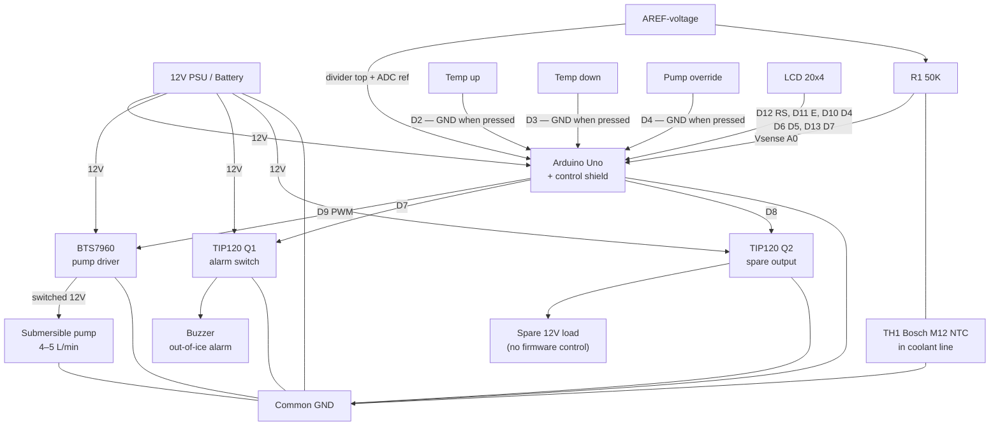
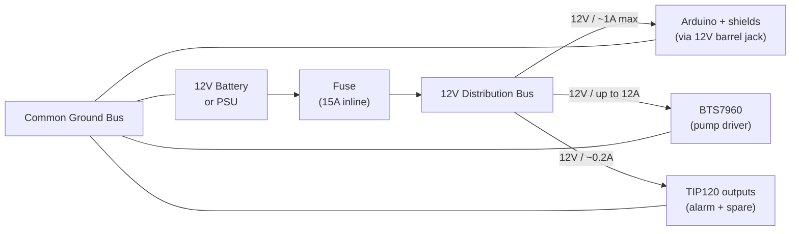
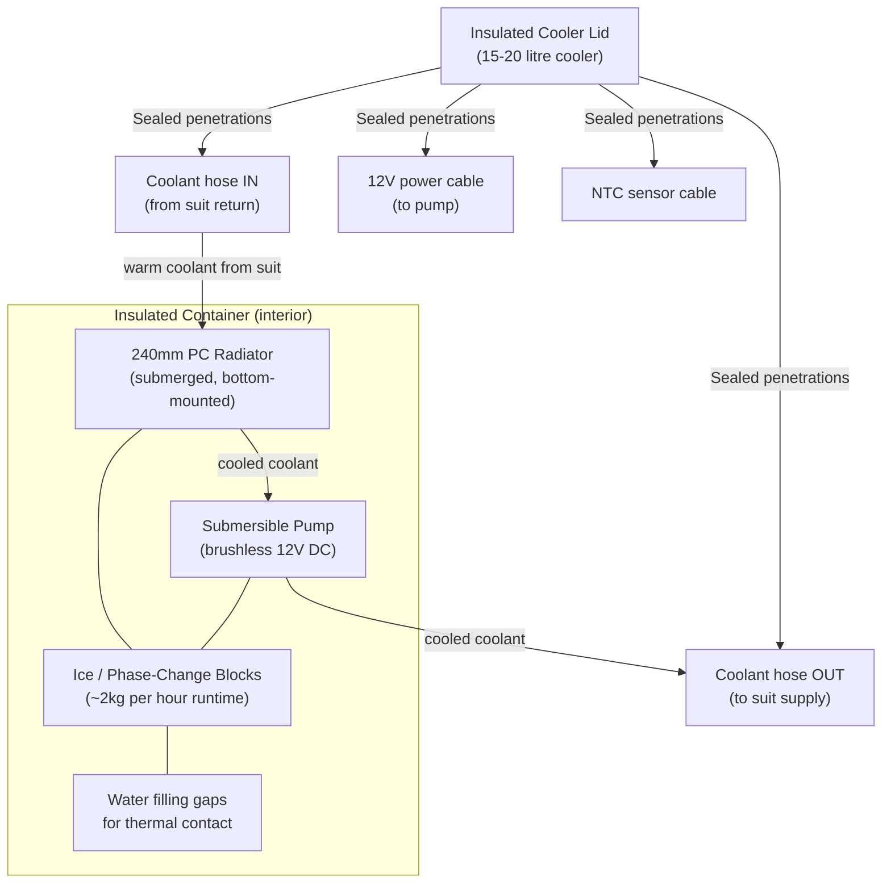

# DIY Liquid Cooling Suit

Those are cooling suits, used in the lowest layer on space suits.
It has hoses for circulation of cooling medium. 
A single layer of fabric may be used, with the tubing either on the inside directly contacting the wearer's skin, or on the outside separated by the fabric. If two layers of fabric are used, stitched channels can be formed which enclose the tubing between the two fabric layers. Where flame resistance is needed, the garment may be constructed out of materials such as nomex. 
If anyone has seen the apollo 13 movie, the boxes carried by the astronauts on the way to the space capsule is a heat exchanger that provides cooling until the suits can be hooked up to the capsules internal cooling system.
That box also provides O2.

I think that NASA just used ice, battery and a pump in those boxes, and you need the capacity to at least transport 200W because the human body generates about 100W. One could rip out the heat exchanger from a car, the bit who heats air, make the suit out of spandex and sew in loops. Mesh cloth or mesh garments are also suitable. 
A radiator for a CPU liquid cooler should be ideal. Hook that up to a aquarium pump or similar, and the heat exchanger/radiator that goes in a bucket of ice cubes or phase shifting material and water. The pump will need to be able to flow around 4 liters per minute, and must run on 12V and accept PWM control.

The cooling loop is made of 
6 pvc hoses in parallel, measuring 6 mm ØID x 9 mm ØOD, length 4 meters per hose. Total internal surface of the hoses is 4524.7 cm². External surface 6789.6 cm2. The heat exchanger as well as hoses and pump contain 3 liters of inhibited propylene glycol and water mix (25–30%). Brass or metal connectors, hose barbs, and hose clamps should be used. Two manifolds are required — one for liquid distribution and one for collection — built from T-pieces, elbows, and other fittings (see [Coolant plumbing](#coolant-plumbing) below).

## Table of contents

- [Thermal Calculations](#thermal-calculations)
  - [Cooling 3 liters from 40°C to 18°C](#cooling-3-liters-of-waterglycol-from-40c-to-18c-in-150-seconds)
  - [Ice as a cooling medium](#ice-as-a-cooling-medium)
  - [Maintaining 18°C coolant temperature](#maintaining-18c-coolant-temperature)
  - [Liquid-to-ice heat exchanger](#liquid-to-ice-heat-exchanger)
- [Phase-Change Materials](#phase-change-materials)
- [Temperature Control](#temperature-control)
  - [Coolant options](#coolant-options)
  - [Preliminary Arduino Firmware](#preliminary-arduino-firmware)
- [Required Hardware](#required-hardware)
- [Wiring Diagram](#wiring-diagram)
- [12V Power Setup](#12v-power-setup)
- [Container Setup](#container-setup)
- [Suit Fabric](#suit-fabric)
- [Coolant plumbing](#coolant-plumbing)
- [Pump Selection](#pump-selection)

---

## Thermal Calculations

### Cooling 3 liters of water/glycol from 40°C to 18°C in 150 seconds

How much heat must be removed:

Q = mc∆T  
m = 3 kg  
Specific heat capacity of water = 4.18 J/g°C  
Temperature change: 40 - 18 = 22°C

Q = 3 kg × 4180 J/kg°C × 22°C = **275,880 J**

This means the heat exchanger removes 275,880 joules of heat from the cooling loop in 150 seconds.

To convert joules into watts: Joules / time in seconds = **~1,848W** during initial cooldown.

---

### Ice as a cooling medium

To remove 1848.8 watts of energy from 3 liters of water at 40°C over 150 seconds:

Q = P × t = 1848.8 W × 150 s = **277,320 J**

Mass of water being cooled:

m = Q / (c × ΔT) = 277320 / (4.18 × 40) ≈ **1.658 kg**

So approximately 1.65 kilograms of ice would be needed for the initial cooldown phase.

It will take approximately 42.86 seconds to remove 275,880 joules of heat with a flow rate of 5 liters per minute.

---

### Maintaining 18°C coolant temperature

With ambient air temperature at 40°C:

ΔT_initial = 40°C - 18°C = 22°C

m_ice = (m × c × ΔT_initial) / L_f  
m_ice = (3 kg × 4186 J/kg°C × 22°C) / 334,000 J/kg ≈ **0.827 kg per hour**

Including 100W body heat: approximately **~2 kg of ice per hour** is needed.  
Flow rate for maintenance: **~2.5 liters per minute**.

---

### Liquid-to-ice heat exchanger

To extract 275,880 J of heat from ice over 150 seconds using 10mm OD / 0.8mm wall copper tube with a ΔT of 40°C and convective heat transfer coefficient of 200 W/m²·K:

Required copper tube length: approximately **7.32 meters**  
Inner surface: 1.848 m²  
Outer surface: 2.198 m²

---

## Phase-Change Materials

I suggest using Cold Gel Packs, Campingaz or similar brand as they reportedly last longer than ice cubes.

You can make something similar yourself:  
https://m.youtube.com/watch?v=Nqxjfp4Gi0k

- Heat capacity of the salt/water mixture: approximately **5,451.5 J/°C**
- Latent heat: approximately **3.39 J/g°C**
- Total weight of mixture: **1,695 grams**
- Be aware that it might expand slightly when frozen.
- Heat capacity of 1,695 grams of water ice: approximately **3,543.55 J/°C**

Also look at:  
https://www.cryopak.com/solutions/refrigerants/phase-change-materials/phase-5/

- Heat capacity of 2 kg mixture: approximately **6,432.92 J/°C**
- Heat capacity of 2 kg water ice: **4,180 J/°C**
- 2 kg of the mixture will last approximately **3 hours** — much better than water ice.

---

## Temperature Control

To keep coolant at 18°C (0°C coolant is uncomfortable and risks hypothermia):

Use an automotive NTC temperature sensor and an Arduino to control temperature. Sensor datasheet: [Bosch M12 NTC temperature sensor (PDF)](https://www.bosch-motorsport.com/content/downloads/Raceparts/Resources/pdf/Data%20sheet_70101387_Temperature_Sensor_NTC_M12.pdf)

Arduino shield schematic: [arduino-shield.pdf](arduino-shield/arduino-shield.pdf) ([shield project folder](arduino-shield/))

Monitor the suit's output temperature and use PWM control to regulate pump speed.

Why **inhibited propylene glycol** and water? The ice bath and phase-change blocks can drive slush **below 0°C** at the heat exchanger. A **25–30% PG mix** keeps the loop liquid while staying thin enough to pump through 6 mm hoses. Unlike ethylene glycol antifreeze, propylene glycol is **biodegradable and low-toxicity** — a better fit near a wearable loop (still not for drinking). Use secure hose barbs and clamps, pressure-test the loop, and increase PG percentage only if slush goes colder than your mix rating.

### Coolant options

#### Recommended — inhibited propylene glycol + water (25–30% mix)

**Best balance of cost, safety, and compatibility for this build.**

| Property | Detail |
| --- | --- |
| **Toxicity** | Non-toxic, food-grade safe. Used in RVs, food processing, and HVAC. Unlike ethylene glycol, PG is biodegradable and presents a much lower hazard to people and animals if spilled. |
| **Hose / seal compatibility** | Compatible with typical cooling-system plastics and elastomers — PVC hose, pump seals, and brass barbs used in this project. |
| **Freeze point** | ~**−10°C at 25%** PG — enough margin for light sub-zero slush without the extra viscosity and pumping cost of a 50% mix. Use **30%** if you need more headroom. |
| **Electrical** | **Not dielectric** — conductivity is typically **>2,000 µS/cm** (water-based, conductive). Fine for a pumped hose loop; do not use near bare electronics expecting insulation. |
| **Cost / availability** | Cheapest practical option. Sold as pre-mixed **inhibited** PG antifreeze under names such as **DOWFROST**, **AMSOIL ANT**, **Cryo-Tek**, or generic **RV / marine antifreeze** at hardware and auto stores. Confirm the label says **propylene glycol**, not ethylene glycol. |

Mix with **distilled water** if buying full-strength concentrate; follow the label for your target freeze point.

#### Optional — ElectroCool and similar synthetic fluids

**ElectroCool** (Engineered Fluids) and similar **dielectric** immersion coolants are non-conductive and wash off with soap and water, but they are **much more expensive** and designed for electronics immersion — not as a default for this PVC-hose suit loop. Only consider if you validate compatibility with every hose, pump seal, and fitting, and accept the higher fluid cost.

#### Other alternatives

| Fluid | Notes |
| --- | --- |
| **USP / food-grade PG + water (DIY mix)** | Same family as above; buy PG concentrate and mix yourself. Lowest unit cost. |
| **Glycerol (glycerin) + water** | Non-toxic and biodegradable. Higher viscosity — may reduce flow in 6 mm hoses; weaker freeze protection per percent than PG. |
| **Potassium acetate / formate HTF** | Used in some commercial low-toxicity antifreeze systems. Verify pump, hose, and brass compatibility before use. |

#### Not recommended for a wearable loop

- **Ethylene glycol** (standard automotive antifreeze) — effective antifreeze but **acutely toxic**
- **Legacy PFAS / fluorinated fluids** — environmental persistence and regulatory phase-out
- **Plain water** — inadequate when slush goes below 0°C at the heat exchanger

#### Fill and service

- Use **distilled water** for mixing; tap water minerals cause scale and biofilm
- Pressure-test after fill; monitor for leaks on first runs (see [Coolant plumbing](#coolant-plumbing))
- Label the container and suit loop as containing glycol — not potable

### Preliminary Arduino Firmware

Two switches adjust coolant temperature between 15°C and 25°C in 5°C steps (up/down).  
A third switch toggles manual pump override (full speed on D9, bypasses temperature control).  
Two transistor-switched 12V outputs (TIP120 Darlington, replaces relay modules):
- Output 1 (D7): activates if coolant temperature exceeds 30°C for a set time (buzzer alert — out-of-ice warning)
- Output 2 (D8): spare 12V output (no firmware control)

LCD shows: target temperature, sensed temperature, current pump PWM.

Firmware repository:  
https://github.com/Supermagnum/heatsink/tree/main/firmware

---

## Required Hardware

1. Arduino board (e.g., Arduino Uno)
2. NTC thermistor, [Bosch M12](https://www.bosch-motorsport.com/content/downloads/Raceparts/Resources/pdf/Data%20sheet_70101387_Temperature_Sensor_NTC_M12.pdf) (see [Coolant plumbing](#coolant-plumbing) for mounting)
3. Resistor (50k ohms)
4. 4-line LCD (compatible with LiquidCrystal library)
5. Three guarded STSP switches (temperature up, temperature down, manual pump override)
6. Pump controlled via PWM (BTS7960 motor driver module)
7. Two TIP120 Darlington transistors for 12V switched outputs (alarm buzzer and spare)
8. Breadboard and connecting wire
9. Hose clamps
10. Assorted T-pieces, elbows, connectors, adapters, and tube barbs (metal or PETG — see [Coolant plumbing](#coolant-plumbing))
11. Inhibited propylene glycol antifreeze (propylene, not ethylene) for 25–30% coolant mix
12. Liquid gasket or PTFE thread tape for sealed joints
13. Optional: small valves to control "zones"

### Recommended Additional Components

- **Screw terminal shield** for Arduino (e.g., Seeed Studio Screw Shield) — secures all external wiring without breadboard connections that can vibrate loose
- **BTS7960 43A Motor Driver Module** for pump PWM control — handles well over 12A, includes screw terminals, no soldering required
- **LCD Keypad Shield** (e.g., DFRobot) — provides 4-line LCD and built-in buttons, replacing the 3 separate switches

### Arduino Connections

- Bosch M12 NTC (TH1) and 50K resistor (R1) form a voltage divider on A0; AREF feeds the divider top and sets the ADC reference
- LCD connected to appropriate digital pins
- Switches wired between digital pin and GND (active when grounded); firmware enables internal pull-ups on D2, D3, and D4
- D4 toggles manual pump override on D9 (full PWM); when off, pump speed follows temperature
- PWM pin (D9) connected to BTS7960 signal input
- Digital pins D7 and D8 drive TIP120 transistor bases for the alarm and spare 12V outputs

---

## Wiring Diagram

Signal and power connections for the [Arduino shield](arduino-shield/arduino-shield.pdf). Ground all 12V loads to a common bus.

### Pin summary

| Pin | Function |
| --- | --- |
| A0 | NTC sense (R1 / TH1 junction) |
| AREF | Divider reference (same rail as R1 top) |
| D2 | Target temperature up (+5°C) |
| D3 | Target temperature down (−5°C) |
| D4 | Manual pump override toggle (full PWM on D9) |
| D7 | Q1 alarm driver (auto, >30°C for 2 min) |
| D8 | Q2 spare 12V output |
| D9 | Pump PWM to BTS7960 |
| D5, D6, D10–D13 | LCD data and control |

**Buttons:** Each switch connects **pin → switch → GND**. Internal pull-ups are enabled in firmware (`INPUT_PULLUP`); pressed = LOW.

**NTC divider:** `AREF-voltage — R1 (50K) — A0 — TH1 (Bosch M12) — GND`. Firmware calls `analogReference(EXTERNAL)` so ADC readings match the divider supply.

**Pump override (D4):** Toggles manual full-speed pump on D9 via BTS7960. When off, pump speed follows coolant temperature automatically.

**12V loads:** Pump current goes through the BTS7960 only — not through Arduino pins. Q1 and Q2 switch their loads low-side via TIP120.

---

## 12V Power Setup

**Notes:**
- All components share a common ground
- A 15A inline fuse protects the pump circuit
- The Arduino can be powered directly from 12V via its barrel jack (onboard regulator handles 5V/3.3V internally)
- The BTS7960 handles the high-current pump load — do not run the pump directly from the Arduino
- Use appropriately rated wire gauge: 1.5mm² minimum for pump circuit, 0.5mm² for signal wiring

**Battery sizing (portable use):**
- Pump draw: approximately 3-5A at 12V = 36-60W
- Arduino + transistors + LCD: approximately 0.3A = 4W
- Total: approximately 4-6A continuous
- A 20Ah 12V LiFePO4 battery gives approximately 3-4 hours runtime, matching the phase-change block duration

---

## Container Setup

**Container notes:**
- Use a quality foam-insulated cooler (camping/outdoor grade) with a good lid seal
- The radiator sits at the bottom, fully submerged in ice water — this gives 5-10× better heat transfer than air cooling
- The submersible pump also sits inside the container, drawing chilled water/glycol
- All lid penetrations (hoses, cables, sensor) should be sealed with silicone or grommets to prevent warm air ingress
- Fill gaps around ice/phase-change blocks with water to maximise thermal contact with the radiator
- The NTC sensor tip routes through the lid to measure coolant temperature at the suit return line

**Radiator sizing:**
- A 240mm radiator (air-rated ~300W) performs at approximately 1,500-3,000W when submerged in ice water
- This comfortably covers the 1,848W initial cooldown load and the 100W maintenance load
- A 360mm radiator provides additional headroom, particularly useful with phase-change blocks which have less uniform surface contact than liquid ice water

---

## Suit Fabric

**Recommended: Cotton mesh**

Cotton mesh is the best choice for this application because:
- Breathable open weave allows direct skin contact with the cooling tubes
- Cotton is comfortable and non-irritating against skin during extended wear
- Natural fibre — does not trap heat against the body
- Easy to sew channels or loops for routing the 6mm/9mm PVC hoses
- Washable and durable

**Construction:**
- Sew hose channels directly into the mesh using a zigzag or channel stitch
- Route hoses in parallel loops across the torso, back, and limbs as needed
- Connect the six suit hoses to distribution and collection manifolds (see [Coolant plumbing](#coolant-plumbing))
- Optional zone valves allow sections of the suit to be isolated, reducing flow to areas not needed

---

## Coolant plumbing

Two manifolds are needed: one splits flow from the supply line into the six parallel suit hoses, and one merges the return lines back to the heat exchanger.

**Fittings:**
- Several T-pieces, elbows, and connectors sized for 6 mm ID / 9 mm OD hose
- Metal (brass) barbs and fittings are the most durable option
- Manifolds can alternatively be **3D printed in PETG** if wall thickness and infill are high enough for pressure (typically 40% infill or higher, with solid perimeters around barb ports)

**Bosch M12 sensor mounting (metal route):**
- A suitable **drill and M12 tap** are required to thread the port for the Bosch M12 sensor
- Seal threads with **liquid gasket** or **PTFE tape**

**Assembly and testing:**
- Use liquid gasket or PTFE tape on all threaded connections
- **Pressure-test** the completed loop before use and **monitor for leaks** during initial runs
- Fix any weeping joints before relying on the system in service

---

## Pump Selection

**Requirements:**
- 12V DC brushless, submersible rated
- Flow rate: 4-5 liters/minute (minimum)
- Continuous duty rated
- PWM controllable (dedicated PWM signal wire preferred)
- ½ inch inlet and outlet
- Compatible with inhibited propylene glycol and water mix (25–30%)

**Search terms:**
- "12V DC brushless submersible pump PWM 5LPM"
- "12V DC pump 300LPH PWM control"

Check aquarium suppliers, solar pump suppliers, and irrigation suppliers. Gear and diaphragm pumps handle PWM better than centrifugal types at this flow rate. Centrifugal pumps require priming and cannot be controlled as precisely.

**PWM control note:** Many brushless pumps do not natively accept PWM. Use the BTS7960 module to chop power from the supply side, or specifically source pumps with a dedicated PWM input pin (separate from the power wires).
