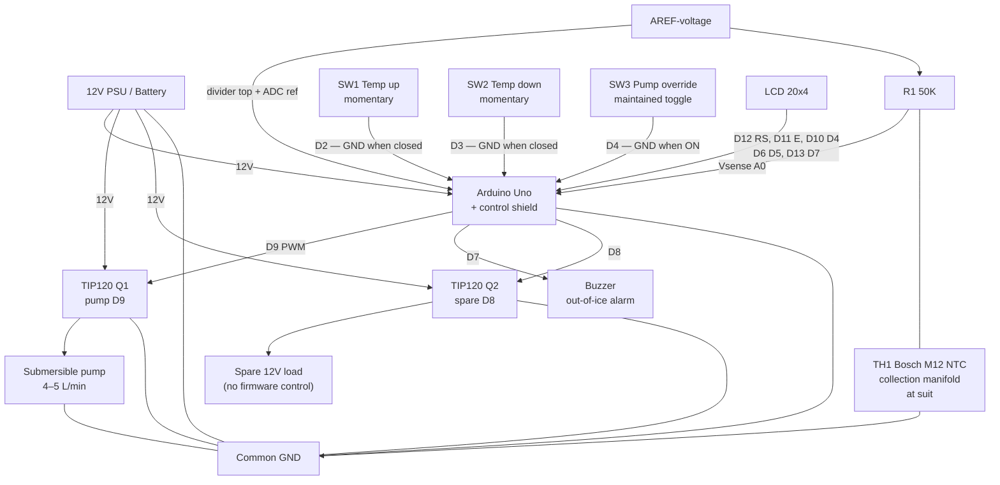
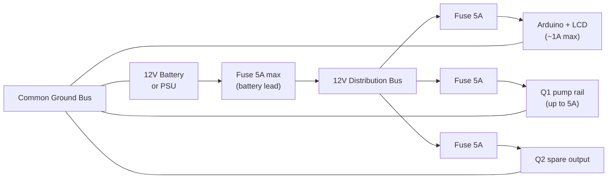
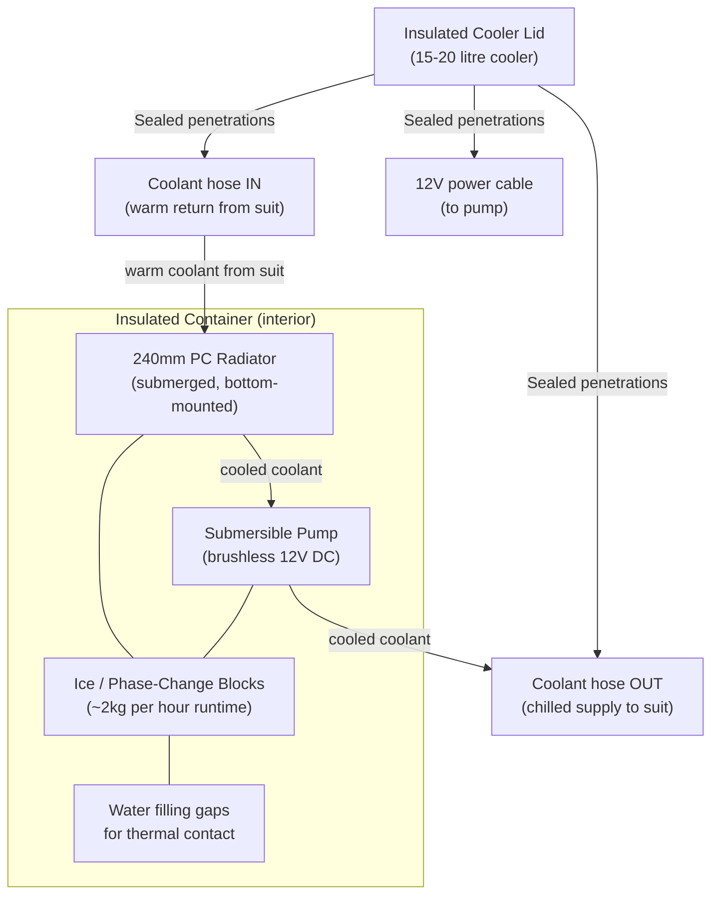

# DIY Liquid Cooling Suit

Those are cooling suits, used in the lowest layer on space suits.
It has hoses for circulation of cooling medium. 
A single layer of fabric may be used, with the tubing either on the inside directly contacting the wearer's skin, or on the outside separated by the fabric. If two layers of fabric are used, stitched channels can be formed which enclose the tubing between the two fabric layers. Where flame resistance is needed, the garment may be constructed out of materials such as nomex. 
If anyone has seen the apollo 13 movie, the boxes carried by the astronauts on the way to the space capsule is a heat exchanger that provides cooling until the suits can be hooked up to the capsules internal cooling system.
That box also provides O2.

I think that NASA just used ice, battery and a pump in those boxes, and you need the capacity to at least transport 200W because the human body generates about 100W. One could rip out the heat exchanger from a car, the bit who heats air, make the suit out of spandex and sew in loops. Mesh cloth or mesh garments are also suitable. 
A radiator for a CPU liquid cooler should be ideal. Hook that up to a aquarium pump or similar, and the heat exchanger/radiator that goes in a bucket of ice cubes or phase shifting material and water. The pump will need to be able to flow around 4 liters per minute, and must run on 12V and accept PWM control.

The cooling loop is made of 
6 pvc hoses in parallel, measuring 6 mm ØID x 9 mm ØOD, length 4 meters per hose. Total internal surface of the hoses is 4524.7 cm². External surface 6789.6 cm2. The heat exchanger as well as hoses and pump contain 3 liters of inhibited propylene glycol and water mix (25–30%). Brass or metal connectors, hose barbs, and hose clamps should be used. Two manifolds are required — one for liquid distribution and one for collection — built from T-pieces, elbows, and other fittings (see [Coolant plumbing](#coolant-plumbing) below).

## Table of contents

- [Thermal Calculations](#thermal-calculations)
  - [Cooling 3 liters from 40°C to 18°C](#cooling-3-liters-of-waterglycol-from-40c-to-18c-in-150-seconds)
  - [Ice as a cooling medium](#ice-as-a-cooling-medium)
  - [Maintaining 18°C coolant temperature](#maintaining-18c-coolant-temperature)
  - [Liquid-to-ice heat exchanger](#liquid-to-ice-heat-exchanger)
- [Phase-Change Materials](#phase-change-materials)
- [Temperature Control](#temperature-control)
  - [Coolant options](#coolant-options)
  - [Preliminary Arduino Firmware](#preliminary-arduino-firmware)
- [Required Hardware](#required-hardware)
- [Electronics component list](component-list.md)
  - [Assembly instructions](component-list.md#assembly-instructions)
  - [Board placement guide (arduino-shield.jpg)](component-list.md#board-placement-guide)
  - [Ordering the PCB from Gerber files](component-list.md#ordering-the-pcb-from-gerber-files)
  - [Soldering and wire splicing](component-list.md#soldering-and-wire-splicing)
  - [How to solder (NASA reference)](component-list.md#how-to-solder)
  - [How to splice wire properly](component-list.md#how-to-splice-wire-properly)
  - [Heat-shrink on splices](component-list.md#heat-shrink-on-splices)
- [Wiring Diagram](#wiring-diagram)
- [12V Power Setup](#12v-power-setup)
  - [12V DC safety and dry locations](#12v-dc-safety-and-dry-locations)
- [Container Setup](#container-setup)
- [Suit Fabric](#suit-fabric)
- [Coolant plumbing](#coolant-plumbing)
- [Pump Selection](#pump-selection)

---

## Thermal Calculations

### Cooling 3 liters of water/glycol from 40°C to 18°C in 150 seconds

How much heat must be removed:

Q = mc∆T  
m = 3 kg  
Specific heat capacity of water = 4.18 J/g°C  
Temperature change: 40 - 18 = 22°C

Q = 3 kg × 4180 J/kg°C × 22°C = **275,880 J**

This means the heat exchanger removes 275,880 joules of heat from the cooling loop in 150 seconds.

To convert joules into watts: Joules / time in seconds = **~1,848W** during initial cooldown.

---

### Ice as a cooling medium

To remove 1848.8 watts of energy from 3 liters of water at 40°C over 150 seconds:

Q = P × t = 1848.8 W × 150 s = **277,320 J**

Mass of water being cooled:

m = Q / (c × ΔT) = 277320 / (4.18 × 40) ≈ **1.658 kg**

So approximately 1.65 kilograms of ice would be needed for the initial cooldown phase.

It will take approximately 42.86 seconds to remove 275,880 joules of heat with a flow rate of 5 liters per minute.

---

### Maintaining 18°C coolant temperature

With ambient air temperature at 40°C:

ΔT_initial = 40°C - 18°C = 22°C

m_ice = (m × c × ΔT_initial) / L_f  
m_ice = (3 kg × 4186 J/kg°C × 22°C) / 334,000 J/kg ≈ **0.827 kg per hour**

Including 100W body heat: approximately **~2 kg of ice per hour** is needed.  
Flow rate for maintenance: **~2.5 liters per minute**.

---

### Liquid-to-ice heat exchanger

To extract 275,880 J of heat from ice over 150 seconds using 10mm OD / 0.8mm wall copper tube with a ΔT of 40°C and convective heat transfer coefficient of 200 W/m²·K:

Required copper tube length: approximately **7.32 meters**  
Inner surface: 1.848 m²  
Outer surface: 2.198 m²

---

## Phase-Change Materials

I suggest using Cold Gel Packs, Campingaz or similar brand as they reportedly last longer than ice cubes.

You can make something similar yourself:  
https://m.youtube.com/watch?v=Nqxjfp4Gi0k

- Heat capacity of the salt/water mixture: approximately **5,451.5 J/°C**
- Latent heat: approximately **3.39 J/g°C**
- Total weight of mixture: **1,695 grams**
- Be aware that it might expand slightly when frozen.
- Heat capacity of 1,695 grams of water ice: approximately **3,543.55 J/°C**

Also look at:  
https://www.cryopak.com/solutions/refrigerants/phase-change-materials/phase-5/

- Heat capacity of 2 kg mixture: approximately **6,432.92 J/°C**
- Heat capacity of 2 kg water ice: **4,180 J/°C**
- 2 kg of the mixture will last approximately **3 hours** — much better than water ice.

---

## Temperature Control

To keep coolant at 18°C (0°C coolant is uncomfortable and risks hypothermia):

Use an automotive NTC temperature sensor and an Arduino to control temperature. Sensor datasheet: [Bosch M12 NTC temperature sensor (PDF)](https://www.bosch-motorsport.com/content/downloads/Raceparts/Resources/pdf/Data%20sheet_70101387_Temperature_Sensor_NTC_M12.pdf)

Arduino shield schematic: [arduino-shield.pdf](arduino-shield/arduino-shield.pdf) ([shield project folder](arduino-shield/))

Mount the Bosch M12 NTC in the **collection manifold** (return side), as close to the suit as possible — **not in the ice container**. This measures warm coolant leaving the suit for pump control. Use PWM to regulate pump speed from that reading.

Why **inhibited propylene glycol** and water? The ice bath and phase-change blocks can drive slush **below 0°C** at the heat exchanger. A **25–30% PG mix** keeps the loop liquid while staying thin enough to pump through 6 mm hoses. Unlike ethylene glycol antifreeze, propylene glycol is **biodegradable and low-toxicity** — a better fit near a wearable loop (still not for drinking). Use secure hose barbs and clamps, pressure-test the loop, and increase PG percentage only if slush goes colder than your mix rating.

### Coolant options

#### Recommended — inhibited propylene glycol + water (25–30% mix)

**Best balance of cost, safety, and compatibility for this build.**

| Property | Detail |
| --- | --- |
| **Toxicity** | Non-toxic, food-grade safe. Used in RVs, food processing, and HVAC. Unlike ethylene glycol, PG is biodegradable and presents a much lower hazard to people and animals if spilled. |
| **Hose / seal compatibility** | Compatible with typical cooling-system plastics and elastomers — PVC hose, pump seals, and brass barbs used in this project. |
| **Freeze point** | ~**−10°C at 25%** PG — enough margin for light sub-zero slush without the extra viscosity and pumping cost of a 50% mix. Use **30%** if you need more headroom. |
| **Electrical** | **Not dielectric** — conductivity is typically **>2,000 µS/cm** (water-based, conductive). Fine for a pumped hose loop; do not use near bare electronics expecting insulation. |
| **Cost / availability** | Cheapest practical option. Sold as pre-mixed **inhibited** PG antifreeze under names such as **DOWFROST**, **AMSOIL ANT**, **Cryo-Tek**, or generic **RV / marine antifreeze** at hardware and auto stores. Confirm the label says **propylene glycol**, not ethylene glycol. |

Mix with **distilled water** if buying full-strength concentrate; follow the label for your target freeze point.

#### Optional — ElectroCool and similar synthetic fluids

**ElectroCool** (Engineered Fluids) and similar **dielectric** immersion coolants are non-conductive and wash off with soap and water, but they are **much more expensive** and designed for electronics immersion — not as a default for this PVC-hose suit loop. Only consider if you validate compatibility with every hose, pump seal, and fitting, and accept the higher fluid cost.

#### Other alternatives

| Fluid | Notes |
| --- | --- |
| **USP / food-grade PG + water (DIY mix)** | Same family as above; buy PG concentrate and mix yourself. Lowest unit cost. |
| **Glycerol (glycerin) + water** | Non-toxic and biodegradable. Higher viscosity — may reduce flow in 6 mm hoses; weaker freeze protection per percent than PG. |
| **Potassium acetate / formate HTF** | Used in some commercial low-toxicity antifreeze systems. Verify pump, hose, and brass compatibility before use. |

#### Not recommended for a wearable loop

- **Ethylene glycol** (standard automotive antifreeze) — effective antifreeze but **acutely toxic**
- **Legacy PFAS / fluorinated fluids** — environmental persistence and regulatory phase-out
- **Plain water** — inadequate when slush goes below 0°C at the heat exchanger

#### Fill and service

- Use **distilled water** for mixing; tap water minerals cause scale and biofilm
- Pressure-test after fill; monitor for leaks on first runs (see [Coolant plumbing](#coolant-plumbing))
- Label the container and suit loop as containing glycol — not potable

### Preliminary Arduino Firmware

Two **momentary** switches adjust coolant temperature between 15°C and 25°C in 5°C steps (up/down).  
A **maintained toggle** switch on D4 enables manual pump override (full PWM on D9); off returns to automatic temperature control.  
Outputs on the [Arduino shield](arduino-shield/arduino-shield.pdf):
- **D9 → Q1 (TIP120):** pump PWM (temperature-controlled, or manual override via D4)
- **D7:** buzzer — out-of-ice alarm (>30°C for 2 minutes)
- **D8 → Q2 (TIP120):** spare 12V output (not used in current firmware)

LCD shows: target temperature, sensed temperature, current pump PWM.

Firmware repository:  
https://github.com/Supermagnum/heatsink/tree/main/firmware

---

## Required Hardware

1. **Arduino Uno R3** — bottom of the stack; see [component list](component-list.md)
2. [Heatsink control shield](arduino-shield/arduino-shield.pdf) — stacks on the Uno; [placement diagram](arduino-shield/arduino-shield.jpg) shows part positions, diode direction, and **+** wire marks. Order bare PCBs from [`arduino-shield/gerbers/`](arduino-shield/gerbers/) ([how to submit Gerbers](component-list.md#ordering-the-pcb-from-gerber-files)), then follow [assembly instructions](component-list.md#assembly-instructions). New to soldering? **20 W iron** and NASA/splice guides in [component list — Soldering and wire splicing](component-list.md#soldering-and-wire-splicing)
3. **LCD shield, 20×4, no buttons** — HD44780 display-only shield on top of the stack (not an LCD Keypad Shield)
4. NTC thermistor, [Bosch M12](https://www.bosch-motorsport.com/content/downloads/Raceparts/Resources/pdf/Data%20sheet_70101387_Temperature_Sensor_NTC_M12.pdf) (see [Coolant plumbing](#coolant-plumbing) for mounting)
5. **R1** — **MFP50SBBE52-50K** (50 kΩ, 0.1%) — DigiKey **MFP50SBBE52-50K-ND**
6. **D1–D3** — three **1N5407RL** flyback diodes — DigiKey **1N5407RL-ND** (or **1N5407RLG-ND** if unavailable)
7. **2× M3 nylon bolt and nut** — mount **Q1** and **Q2** tabs only; **no metal** hardware (12 V)
8. Shield stacking headers — DigiKey **1528-1074-ND** (Adafruit #85), one kit per bare control shield for Uno/LCD stack ([full DigiKey list](component-list.md#digikey-quick-order-bare-shield-populate))
9. Three **panel switches** on **SW1–SW3** (1×3 headers): two **100SP4T1B2M2QE** momentary (temp up/down), one **ANT13SECQE** maintained toggle (pump manual/auto). **Switch guards** (100SP / ANT compatible) recommended to prevent accidental actuation — especially on SW3
10. 12V submersible pump (4–5 L/min) — switched by **Q1 TIP120 on D9** on the control shield (max **5A**)
11. Optional: **5A inline fuses** on each 12V power cable branch (see [12V Power Setup](#12v-power-setup))
12. Crimped leads / screw terminals for panel switches, NTC, and 12 V — see [component list](component-list.md)
13. Hose clamps
14. Assorted T-pieces, elbows, connectors, adapters, and tube barbs (metal or PETG — see [Coolant plumbing](#coolant-plumbing))
15. Inhibited propylene glycol antifreeze (propylene, not ethylene) for 25–30% coolant mix
16. Liquid gasket or PTFE thread tape for sealed joints
17. Optional: small valves to control "zones"

### Arduino stack and connections

**Stack (bottom → top):** Arduino Uno R3 → heatsink control shield → **LCD shield without buttons**. Panel switches and NTC connect to the control shield headers/terminals only.

- Bosch M12 NTC (TH1) and 50K resistor (R1) form a voltage divider on A0; AREF feeds the divider top and sets the ADC reference
- **LCD shield** (20×4, HD44780, **no keypad**) on D12, D11, D10, D6, D5, D13 — see [Wiring Diagram](#wiring-diagram)
- Switches wired **pin → switch → GND** (active when grounded); firmware enables internal pull-ups on D2, D3, and D4
- **D2 / D3:** momentary — one temperature step per actuation
- **D4:** maintained toggle — ON = manual pump override, OFF = automatic
- D9 PWM drives **Q1 TIP120** on the shield — low-side switch for the pump (up to 5A)
- D7 drives the **buzzer** alarm output
- D8 drives **Q2 TIP120** for the spare 12V output
- Q1 and Q2 are TO-220 packages clamped to **built-in copper thermal zones** with **M3 nylon bolt and nut** each — **no metal mounting hardware** (12 V on the tab). **No add-on heatsinks**; the PCB spreads heat from the transistor tabs

---

## Wiring Diagram

Signal and power connections for the [Arduino shield](arduino-shield/arduino-shield.pdf). Ground all 12V loads to a common bus.

### Pin summary

| Pin | Function |
| --- | --- |
| A0 | NTC sense (R1 / TH1 junction) |
| AREF | Divider reference (same rail as R1 top) |
| D2 | SW1 momentary — target temperature up (+5°C per actuation) |
| D3 | SW2 momentary — target temperature down (−5°C per actuation) |
| D4 | SW3 maintained toggle — manual pump override (ON = full PWM) |
| D7 | Buzzer alarm (auto, >30°C for 2 min) |
| D8 | Q2 spare 12V output |
| D9 | Pump PWM via Q1 TIP120 |
| D5, D6, D10–D13 | LCD data and control |

**Switch wiring:** Panel switches **100SP4T1B2M2QE** (SW1, SW2) and **ANT13SECQE** (SW3) connect via **SW1–SW3** headers: **pin → switch → GND**. Internal pull-ups are enabled in firmware (`INPUT_PULLUP`); closed / ON = LOW. Add **switch guards** (100SP / ANT series) on the panel to reduce accidental toggles — especially on the pump override (SW3).

**NTC placement:** TH1 threads into the **collection manifold** on the return path, positioned **as close to the suit as practical** — not in the insulated container. The sensor cable runs back to the Arduino shield.

**NTC divider:** `AREF-voltage — R1 (50K) — A0 — TH1 (Bosch M12) — GND`. Firmware calls `analogReference(EXTERNAL)` so ADC readings match the divider supply.

**Pump override (SW3 / D4):** Maintained toggle — **ON** = full pump PWM via Q1; **OFF** = automatic temperature control.

**Temp switches (SW1 / SW2):** Momentary — one ±5°C step per actuation (debounced).

**12V loads:** Pump current flows through **Q1** on the shield — not through Arduino I/O pins directly. Q2 switches the spare load. D7 drives the buzzer. Add a **5A inline fuse** on each 12V feed (Arduino, pump/Q1, Q2) if not already fused at the battery.

---

## 12V Power Setup

**Notes:**
- All components share a common ground
- Use **5A inline fuses maximum** on each 12V power cable branch (battery lead plus Arduino, pump/Q1, and Q2 feeds). Do not exceed 5A fuse rating on these cables
- The Arduino can be powered directly from 12V via its barrel jack (onboard regulator handles 5V/3.3V internally)
- The pump is switched by **Q1 TIP120 on the control shield** (D9 PWM) — do not connect pump current through Arduino pins
- Q1 and Q2 are rated up to 5A; size the pump accordingly
- Use appropriately rated wire gauge: 1.5mm² minimum for pump circuit, 0.5mm² for signal wiring
- TIP120 transistors (Q1, Q2) mount to **copper thermal zones** on the shield PCB with **M3 nylon** bolt and nut — **do not use metal** fasteners at the tabs; no separate heatsinks needed

**Battery sizing (portable use):**
- Pump draw: approximately 3-5A at 12V = 36-60W (Q1 TIP120 and pump fuse at **5A max**)
- Arduino + transistors + LCD: approximately 0.3A = 4W
- Total: approximately 4-5A continuous with a 5A fuse on the pump feed at the upper limit — avoid sustained overload
- A 20Ah 12V LiFePO4 battery gives approximately 3-4 hours runtime, matching the phase-change block duration

### 12V DC safety and dry locations

12 V is low enough that it is not mains shock hazard, but this system can still draw **several amps continuously**. Treat wiring like any other DC power installation: fused, correct gauge, and kept away from coolant and condensation.

**Electrical safety (12 V DC):**

- **Fuse every branch** at **5 A maximum** (battery lead plus Arduino, pump/Q1, and Q2). Fuses protect wire and battery from shorts — not optional.
- **Wire gauge:** **1.5 mm² minimum** on pump and battery feeds; **0.5 mm²** for signals. Undersized wire heats up under 3–5 A load.
- **Polarity:** Double-check **+12 V and GND** before connecting the battery. Reverse polarity can destroy the Arduino, shield, and pump controller.
- **One common ground** for battery, Arduino stack, pump return, and Q1/Q2 switching. Do not rely on the suit or frame as a ground path.
- **Pump current through Q1 only** — never through Arduino pins. The TIP120 switches the low side; the pump (+) comes from the fused 12 V bus.
- **Q1 / Q2 tab fasteners:** **M3 nylon** bolt and nut only — **no metal** at the transistor tabs (live **12 V**).
- **De-energize for wiring** — disconnect the battery or remove fuses when crimping, moving terminals, or opening the control enclosure.
- **Strain relief and insulation** — no bare copper at the panel or inside the box; use screw terminals or crimps where possible. **Every soldered splice must be covered with heat-shrink** (the [splice reference video](component-list.md#soldering-and-wire-splicing) does not show this step). Tie down cables so connectors are not pulled loose in use.
- **Coolant is conductive** — a glycol leak onto bare 12 V terminals can cause shorts, heating, or fire. Keep splices out of drip paths; wipe spills before re-energizing.
- **Batteries:** Use a proper 12 V pack (e.g. LiFePO4) with a BMS or charger matched to the chemistry. Do not short the terminals; store and charge in a dry, ventilated area away from flammable material.

**Keep dry — control unit and related electronics:**

Mount the **control unit** in a **dry enclosure** outside the ice container. It consists of:

| Keep dry | Location |
| --- | --- |
| **Arduino Uno R3 + heatsink control shield + LCD shield** (stacked) | Inside a sealed project box or small case on the suit harness, belt, or backpack — **not** in the cooler |
| **12 V battery** (if portable) | Same dry area as the control unit; protect from sweat, rain, and spills |
| **Panel switches** (SW1–SW3) | On the operator panel; guards help mechanically — use splash-aware routing if exposed |
| **NTC cable (TH1)** | Sensor threads into the **wet** manifold; only the **M12 sensor tip** sees coolant. The cable and connector back to the shield must stay **dry** — route upward from the manifold and seal the panel penetration |

**Allowed to get wet (by design):**

| Wet location | Parts |
| --- | --- |
| **Inside the insulated cooler** | Submersible pump, radiator, ice/slush, coolant hoses through the lid |
| **Suit loop** | PVC hoses, manifolds, fittings, and the Bosch M12 sensing element in the collection manifold |

Only **12 V pump power** and **coolant hoses** should pass through the cooler lid (grommeted or sealed). Run signal and Arduino power from the **dry control box** — do not submerge the stack, battery, or unsealed junctions. If the enclosure may see humidity, use vented or IP-rated boxes and keep connectors inside the lid line.

See also [Container Setup](#container-setup) for lid penetrations and [component list](component-list.md) for stack parts.

---

## Container Setup

**Container notes:**
- Use a quality foam-insulated cooler (camping/outdoor grade) with a good lid seal
- The radiator sits at the bottom, fully submerged in ice water — this gives 5-10× better heat transfer than air cooling
- The submersible pump also sits inside the container, drawing chilled water/glycol
- All lid penetrations (hoses and **pump 12 V power only**) should be sealed with silicone or grommets to prevent warm air ingress and leaks
- The **Arduino control unit** (stack, battery, dry wiring) stays **outside** the cooler — see [12V DC safety and dry locations](#12v-dc-safety-and-dry-locations)
- Fill gaps around ice/phase-change blocks with water to maximise thermal contact with the radiator
- The NTC sensor is **not** mounted in the container — it sits in the **collection manifold at the suit** (see [Coolant plumbing](#coolant-plumbing))

**Radiator sizing:**
- A 240mm radiator (air-rated ~300W) performs at approximately 1,500-3,000W when submerged in ice water
- This comfortably covers the 1,848W initial cooldown load and the 100W maintenance load
- A 360mm radiator provides additional headroom, particularly useful with phase-change blocks which have less uniform surface contact than liquid ice water

---

## Suit Fabric

**Recommended: Cotton mesh**

Cotton mesh is the best choice for this application because:
- Breathable open weave allows direct skin contact with the cooling tubes
- Cotton is comfortable and non-irritating against skin during extended wear
- Natural fibre — does not trap heat against the body
- Easy to sew channels or loops for routing the 6mm/9mm PVC hoses
- Washable and durable

**Construction:**
- Sew hose channels directly into the mesh using a zigzag or channel stitch
- Route hoses in parallel loops across the torso, back, and limbs as needed
- Connect the six suit hoses to distribution and collection manifolds (see [Coolant plumbing](#coolant-plumbing))
- Optional zone valves allow sections of the suit to be isolated, reducing flow to areas not needed

---

## Coolant plumbing

Two manifolds are needed: one splits flow from the supply line into the six parallel suit hoses, and one merges the return lines back toward the heat exchanger.

**NTC sensor placement:**
- Install the Bosch M12 sensor (TH1) in the **collection manifold** — the return manifold where warmed coolant from the suit hoses combines
- Place the port **as close to the suit as possible**, before the long hose run back to the container
- The sensor measures coolant temperature **leaving the suit**, which is what the Arduino uses for pump control — not the chilled fluid inside the ice box

**Fittings:**
- Several T-pieces, elbows, and connectors sized for 6 mm ID / 9 mm OD hose
- Metal (brass) barbs and fittings are the most durable option
- Manifolds can alternatively be **3D printed in PETG** if wall thickness and infill are high enough for pressure (typically 40% infill or higher, with solid perimeters around barb ports)

**Bosch M12 sensor mounting (metal route):**
- A suitable **drill and M12 tap** are required to thread the port for the Bosch M12 sensor
- Seal threads with **liquid gasket** or **PTFE tape**

**Assembly and testing:**
- Use liquid gasket or PTFE tape on all threaded connections
- **Pressure-test** the completed loop before use and **monitor for leaks** during initial runs
- Fix any weeping joints before relying on the system in service
- Electronics build and bench test: [assembly instructions](component-list.md#assembly-instructions) (Steps 5–6)

---

## Pump Selection

**Requirements:**
- 12V DC brushless, submersible rated
- Flow rate: 4-5 liters/minute (minimum)
- Continuous duty rated
- PWM controllable (dedicated PWM signal wire preferred)
- ½ inch inlet and outlet
- Compatible with inhibited propylene glycol and water mix (25–30%)

**Search terms:**
- "12V DC brushless submersible pump PWM 5LPM"
- "12V DC pump 300LPH PWM control"

Check aquarium suppliers, solar pump suppliers, and irrigation suppliers. Gear and diaphragm pumps handle PWM better than centrifugal types at this flow rate. Centrifugal pumps require priming and cannot be controlled as precisely.

**PWM control note:** The shield uses **Q1 TIP120** on D9 for low-side PWM of the pump. Many brushless pumps tolerate slow PWM on the power side; if the pump stutters, try a pump with a dedicated PWM input wire or add a smoothing capacitor on the pump supply. Stay within the **5A** Q1 and fuse limit.
